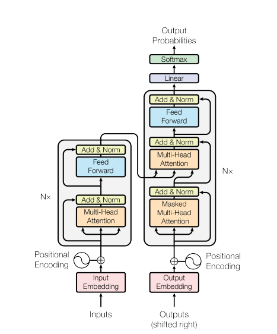

# Projects

- **Micrograd** (An autograd engine)
- **GPT From scratch** (A PyTorch re-implementation of GPT, both training and inference.) <https://arxiv.org/pdf/1706.03762>

This folder contains:
- `micrograd/`: micrograd from scratch (autograd + backprop + MLP notebooks)
- `gpt/`: bigram language model and a Transformer-style character model

## Cool plots/images I've found

### Transformer

### Micrograd loss backprop

